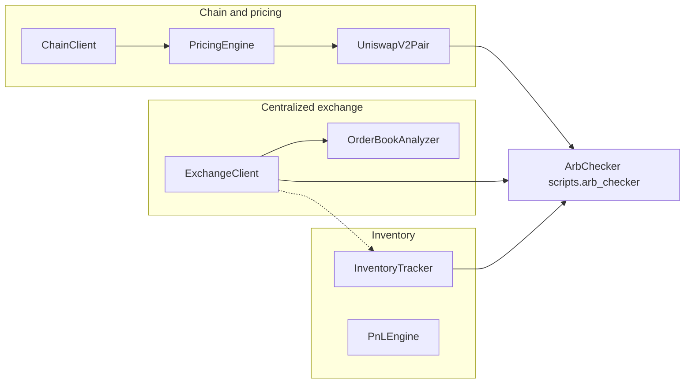

# lab1

Python toolkit for **Ethereum account handling**, **JSON-RPC access**, **transaction analysis**, **Uniswap V2–style pricing** (routing, fork simulation, mempool decoding), **CEX order books** (Binance testnet or live via **`PRODUCTION`**), **cross-venue inventory**, an **arb readiness check** (**`scripts/arb_checker.py`**), and a **closed-loop arbitrage bot** (**`scripts/arb_bot.py`**) with **risk limits**, **kill switch**, **Telegram** alerts (optional), **CSV trade journal**, and **dry-run / signed-dry-run / live** execution paths—with deterministic JSON utilities, linting, and tests wired for local development.

## Features

### `core/`

- **Types** — `Address`, `TokenAmount`, `Token`, `TransactionRequest` (Web3 dict round-trip), `TransactionReceipt`.
- **Wallet** — Load keys from env or encrypted keystore; sign messages (EIP-191), typed data (EIP-712), and transactions; secrets never leak into logs or errors.
- **Serializer** — Canonical JSON + Keccak hash for deterministic signing workflows.
- **Errors** — Typed exceptions for validation, security, and token math.

### `chain/`

- **ChainClient** — Multi-endpoint HTTP RPC with retries, EIP-1559 gas helpers, nonce management, receipts, `eth_call`, revert replay, and optional node health checks.
- **TransactionBuilder** — Fluent builder for gas estimation, fees, sign, broadcast, and wait-for-receipt.
- **TransactionDecoder** — Decodes common ERC-20 and Uniswap-style calldata; parses `Transfer`, `Swap`, `Sync`, and similar logs; extracts revert reasons when possible.
- **`chain.uniswap_v2_router`** — Encodes/decodes Uniswap V2 router swap calldata and return data; metadata is shared with `TransactionDecoder` so selectors stay aligned.
- **CLI analyzer** — Inspect any mined or pending transaction from the command line:

  ```powershell
  python -m chain.analyzer 0x<64-hex-tx-hash> [--rpc https://...]
  ```

  Defaults to **Ethereum mainnet**: `MAINNET_RPC`, then `ETH_MAINNET_RPC`, then `RPC_ENDPOINT`, then a public mainnet RPC. If `RPC_ENDPOINT` is a testnet, set `MAINNET_RPC` to a mainnet URL or pass `--rpc`. Use a **full 32-byte transaction hash** (64 hex digits), not an address.

### `pricing/`

- **`UniswapV2Pair`** — Integer constant-product math (`get_amount_out` / `get_amount_in`), price impact helpers, optional **`from_chain`** via `ChainClient`.
- **`Route` / `RouteFinder`** — Multi-hop paths; **`find_best_route`** maximizes net output after gas priced in the output token.
- **`PriceImpactAnalyzer`** — Trade-size impact tables and cost estimates including gas.
- **`ParsedSwap` / `MempoolMonitor`** — Decode Uniswap V2 router swaps from pending transactions over WebSocket (`await monitor.start()`).
- **`ForkSimulator`** — Simulate router swaps on a local fork (`eth_call`); **`compare_simulation_vs_calculation`** checks AMM math vs fork for a single hop.
- **`PricingEngine`** — **`get_quote`** combines routing + fork verification; **`Quote`** / **`QuoteError`**; optional mempool callbacks for swaps touching loaded pools.

See **[docs/Week2.md](docs/Week2.md)** for a full package overview. Local fork helper: **`scripts/start_fork.ps1`** (requires [Foundry](https://book.getfoundry.sh/) `anvil`). Optional pytest fork tests: set **`FORK_RPC_URL`** (e.g. `http://127.0.0.1:8545`) and run `pytest -m fork`.

### `exchange/`

- **`ExchangeClient`** — Binance via CCXT: **testnet** when **`PRODUCTION=false`**, **live** spot when **`PRODUCTION=true`** (**`config.config`**). **`fetch_order_book`**, **`fetch_balance`**, **`get_trading_fees`**, **`max_taker_fee_bps_for_symbols`** (multi-pair taker → bps), all monetary fields as **`Decimal`**; sliding-window **request weight** limiting; optional **IOC limit** orders.
- **`WeightRateLimiter`** — Binance-style IP weight budget per time window.
- **`OrderBookAnalyzer` + CLI** — Walk the book for fills / slippage; **`python -m exchange.orderbook`** (or **`.\run.ps1 orderbook ETH/USDT`**).

### `inventory/`

- **`InventoryTracker`** — Balances per **`Venue`** (e.g. Binance vs wallet), **`snapshot`**, **`can_execute`** (both arb legs), **`record_trade`**, **`skew`** / **`get_skews`** for rebalance signals.
- **`RebalancePlanner`** — Transfer **plans** (fees, min operating balance), **`estimate_cost`**; **`python -m inventory.rebalancer`**.
- **`PnLEngine`** — **`ArbRecord`** gross/net PnL and bps; **`summary`**, **`export_csv`**; **`python -m inventory.pnl`**.

### `scripts/` — arb check

- **`ArbChecker`** (**`scripts/arb_checker.py`**) — Combines a loaded **Uniswap V2** pool (**`PricingEngine.load_pools`**), **CEX** order book (**`ExchangeClient`**), and **inventory** preflight (**`InventoryTracker`**). Read-only; no trades. Run: **`python -m scripts.arb_checker ETH/USDT --size 2.0`** or **`python scripts/arb_checker.py ...`** (requires **`--rpc`**, **`--pool`** or **`ARB_V2_POOL`**, and Binance config for live balances).

### `scripts/` — arbitrage bot (`arb_bot.py`)

- **`ArbBot`** — Async loop: **`SignalGenerator`** + **`SignalScorer`** + **`Executor`**, **`RiskManager`**, file **kill switch**, optional **Telegram** (alerts + slash commands), **CSV** trade journal, optional **Prometheus** metrics, **circuit breaker** (webhook + Telegram on trip). Supports **`--demo`** (fully offline scripted run), **`--dry-run`** (no broadcast; **`ARB_DRY_RUN_MODE=signed`** builds and signs the DEX tx only), and **`--live`** with env-gated **DEX** router swaps.
- **CEX fees** — Non-demo runs prefer **CCXT `fetch_trading_fee`** taker rates across **`--pairs`** (max bps), unless **`ARB_CEX_TAKER_BPS`** is set. See **[docs/Week5.md](docs/Week5.md)** and **`ARB_DRY_RUN_MODE`** in **`.env.example`**.

```powershell
python scripts/arb_bot.py --demo
python scripts/arb_bot.py --pairs ETH/USDC --tick 2 --dry-run
```

See **[docs/Week3.md](docs/Week3.md)** for **`exchange`**, **`inventory`**, **`scripts.arb_checker`**, and CLI examples (order book, IOC trades, snapshots, arb checker, PnL). Quick PnL demo: `python scripts/pnl_demo.py`.

## Architecture

Modules interact roughly as follows (arrows show primary data flow for the arb workflow):



- **`ArbChecker`** reads **DEX** prices from pools loaded on **`PricingEngine`**, **CEX** quotes from **`ExchangeClient`**, and checks **`InventoryTracker.can_execute`** for both legs.
- **`ArbBot`** (**`scripts/arb_bot.py`**) closes the loop: it scores signals, runs the **executor** (with simulation or live legs per config), enforces **`risk`** limits, and writes monitoring output (**logs**, **CSV**, optional **Telegram**). Overview: **[docs/Week5.md](docs/Week5.md)**; signal/executor details: **[docs/Week4.md](docs/Week4.md)**.
- **`RebalancePlanner`** and **`PnLEngine`** are separate; they use the same **`inventory`** types for skew and recorded trade economics.

## Definition of done checklist

| Requirement | Notes |
|-------------|--------|
| `ExchangeClient` connects to Binance testnet and fetches order books | Covered by **`tests/test_exchange_client.py`** (`test_integration_connects_and_fetches_order_book`, mocked unit tests). |
| `ExchangeClient` places and cancels LIMIT IOC orders | **`test_integration_limit_ioc_place_and_cancel`** + **`create_limit_ioc_order`** / **`cancel_order`**. |
| Rate limiter prevents API ban | **`WeightRateLimiter`**, **`test_rate_limiter_blocks_when_exhausted`**, **`test_integration_rate_limiter_does_not_break_live_client`**. |
| `OrderBookAnalyzer.walk_the_book` simulates fills | **`tests/test_orderbook.py`** (exact fill, multi-level, insufficient liquidity). |
| `OrderBookAnalyzer` CLI shows depth, spread, imbalance | **`exchange/orderbook.py`** CLI; **`run.ps1 orderbook`**. |
| `InventoryTracker` aggregates balances | **`test_snapshot_aggregates_across_venues`**. |
| `InventoryTracker.can_execute` validates both legs | **`test_can_execute_*`**. |
| `InventoryTracker.skew` detects imbalance | Skew / 60-40 / 90-10 tests in **`tests/test_inventory.py`**. |
| `RebalancePlanner` valid plans + min operating balance | **`test_plan_*`**, **`test_plan_respects_min_operating_balance`**. |
| `PnLEngine` per-trade and aggregate PnL | **`test_gross_pnl_*`**, **`test_summary_*`**, **`test_pnl_mixed_eth_and_usdt_fee_assets`**. |
| `ArbChecker` integrates pricing + exchange + inventory | **`tests/test_arb_checker.py`** (profitable / unprofitable / inventory). |
| At least 25 tests for exchange + orderbook + inventory + arb | **`tests/test_exchange_client.py`** (12) + **`test_orderbook.py`** (8) + **`test_inventory.py`** (24) + **`test_arb_checker.py`** (5) = **49** tests in those files. |
| README architecture diagram | This section. |

## Requirements

- **Python 3.10+**
- Dependencies are listed in **`pyproject.toml`** (including `web3`, `eth-account`, `eth-abi`, `eth-utils`, `python-dotenv`, `rich`, `websockets`, `ccxt`). Dev tools (**`pytest`**, **`ruff`**, **`pre-commit`**) are optional extras: **`[dev]`**; optional **`[metrics]`** installs **`prometheus-client`** for **`arb_bot.py`** when **`PROMETHEUS_METRICS_PORT`** is set.

## Setup and commands

First-time setup and macOS/Linux equivalents: **[docs/setup.md](docs/setup.md)**.

```powershell
.\run.ps1 install   # venv, editable install, ruff, pytest, pre-commit
.\run.ps1 test
.\run.ps1 lint
.\run.ps1 start     # placeholder entry (src/main.py)
.\run.ps1 analyze 0x<64-hex-tx-hash> [--rpc https://...]   # transaction analyzer (needs venv)
.\run.ps1 integration   # full Sepolia suite: smoke + edge cases (needs PRIVATE_KEY)
.\run.ps1 pricing-impact -- --pool 0x... --token WETH    # + RPC env or --rpc; token = ticker you sell
.\run.ps1 pricing-route -- --token-in 0x... --token-out 0x... --amount 10000   # optional --pools; --discover fetch|cache + subgraph env
.\run.ps1 pricing-mempool  # pending Uniswap V2 swaps (needs wss:// in MAINNET_WS / WS_URL)
.\run.ps1 orderbook ETH/USDT --depth 20   # Binance testnet depth + analysis (needs API keys in .env)
```

**Arb check (DEX + CEX + inventory)** — set **`MAINNET_RPC`** (or pass **`--rpc`**), a Uniswap V2 **pair** address (**`--pool`** or **`ARB_V2_POOL`**), and Binance testnet keys for balances:

```powershell
python -m scripts.arb_checker ETH/USDT --size 2.0 --rpc $env:MAINNET_RPC --pool 0xYourV2Pair
```

Copy **`.env.example`** → **`.env`** when you need RPC URLs or secrets locally (see setup doc). For **`arb_bot.py`**, the example file documents **`ARB_*`**, **`DEX_*`**, **`TELEGRAM_*`**, **`ARB_CEX_TAKER_BPS`**, and related variables.

### Integration tests (Sepolia)

``.\run.ps1 integration`` runs ``scripts/integration_test_week1.py`` (smoke transfer, then pytest edge cases). One-liner: ``python scripts/integration_test_week1.py``.

**Smoke step:** sends a small ETH transfer on Sepolia, verifies the signature locally, waits for confirmation, and checks the receipt.

```powershell
$env:PRIVATE_KEY="0x..."
$env:SEPOLIA_RPC="https://eth-sepolia.g.alchemy.com/v2/YOUR_KEY"
.\run.ps1 integration
```

Expected output:

```
Wallet: 0xYourAddress
Balance: 0.5 ETH

Building transaction...
  To: 0xTestRecipient
  Value: 0.0001 ETH
  Estimated Gas: 21000
  Max Fee: 35 gwei
  Max Priority: 2 gwei

Signing...
  Signature valid: ✓
  Recovered address matches: ✓

Sending...
  TX Hash: 0x...

Waiting for confirmation...
  Block: 1234567
  Status: SUCCESS
  Gas Used: 21000 (100%)
  Fee: 0.000735 ETH

Integration test PASSED
```

Requires a funded Sepolia wallet (faucet: https://sepoliafaucet.com/). See **[docs/setup.md](docs/setup.md)** for details.

## Project layout

| Path | Purpose |
|------|---------|
| `core/` | Domain types, wallet, serializer, errors |
| `chain/` | RPC client, builder, decoder, Uniswap V2 router codec, analyzer CLI |
| `pricing/` | AMM pairs, routing, price impact, mempool monitor, fork simulator, pricing engine |
| `exchange/` | Binance (testnet) client, rate limiter, order book analyzer CLI |
| `inventory/` | Cross-venue tracker, rebalance planner, PnL engine, **`usd_mark`** (reference USD for portfolio estimates) |
| `strategy/` | Signals, fees, generator, scorer (see **[docs/Week4.md](docs/Week4.md)**) |
| `executor/` | Two-leg executor, circuit breaker, replay protection, live DEX leg (see **[docs/Week4.md](docs/Week4.md)**) |
| `risk/` | Soft limits, **`RiskManager`**, kill switch, pre-trade validation, safety rails |
| `monitoring/` | Telegram, trade CSV journal, health/metrics helpers, bot logging setup |
| `safety/` | Compatibility re-exports for **`risk.kill_switch`** |
| `config/` | Shared config (`BINANCE_CONFIG`, **`BYBIT_CONFIG`**, **`PRODUCTION`**) |
| `tests/` | Pytest suite (includes **`arb_bot`**, risk, monitoring, executor, strategy) |
| `scripts/` | Sepolia integration; `start_fork.ps1`; pricing CLIs; **`arb_checker.py`**; **`arb_bot.py`** (live / dry-run / demo) |
| `docs/` | Setup, **[Week1.md](docs/Week1.md)**–**[Week5.md](docs/Week5.md)**; optional **`PREFLIGHT_CHECKLIST.md`** |

## Tooling

- **[Ruff](https://docs.astral.sh/ruff/)** — Lint (and optional format); config in `pyproject.toml`.
- **[pytest](https://pytest.org/)** — Tests; `pythonpath` includes the repo root for `import core` / `import chain` / `import pricing` / `import exchange` / `import inventory` / `import scripts`.
- **Pre-commit** — Hooks in `.pre-commit-config.yaml` (includes **`detect-private-key`**). Run after clone: `.\run.ps1 install` or `pre-commit install` inside the venv.

## Why `run.ps1`?

On Windows, **PowerShell** avoids relying on GNU Make and Unix-only paths (`venv/bin`, etc.). See **`docs/setup.md`** for bash-friendly commands if you are not using PowerShell.
